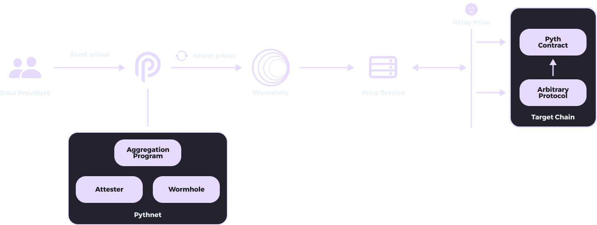

# Cross-chain

Pyth uses a cross-chain mechanism to transfer prices from [Pythnet](pythnet.md) to target chains.
The diagram below shows how prices are delivered from Pythnet to target chains:

Data providers publish their prices on Pythnet. The on-chain [oracle program](oracle-program.md) then aggregates prices for a feed to obtain the aggregate price and confidence. Next, the attester program regularly attests to the most recently observed Pyth prices and creates a Wormhole message to be sent to the Wormhole contract on Pythnet. The Wormhole guardians then observe the attestation message and create a signed VAA for the message.

The price service API continually listens to Wormhole for Pyth price update messages. It stores the latest update message in memory and exposes HTTP and websocket APIs for retrieving the latest update. (Anyone can run an instance of this webservice, but the Pyth Data Association runs a public instance for convenience.) When a user wants to use a Pyth price in a transaction, they retrieve the latest update message (a signed VAA) from the price service and submit it in their transaction. The target chain Pyth contract will verify the validity of the price update message and, if it is valid, store the new price in its on-chain storage. See [pull updates](../pythnet-price-feeds/on-demand.md) for more details about this process.

Finally, on-chain protocols integrate with the Pyth contract via a simple API that retrieves the current Pyth price from its on-chain storage. This API will return the current price as long as it has been updated sufficiently recently; this approach works because users will have updated the Pyth price earlier in the same transaction. Protocols can configure the recency threshold to suit their needs — e.g., latency sensitive applications can set a lower threshold than the default.
