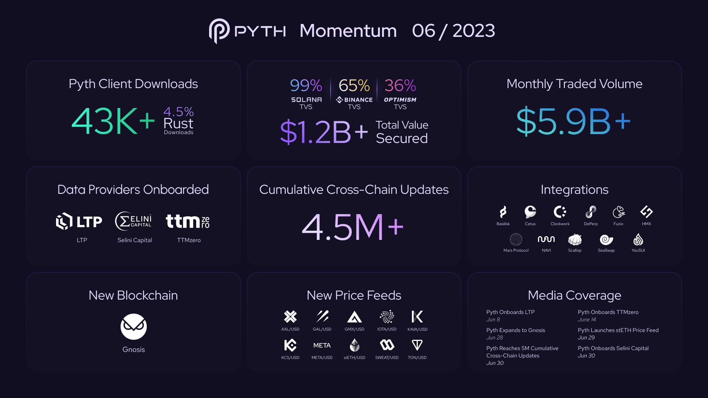
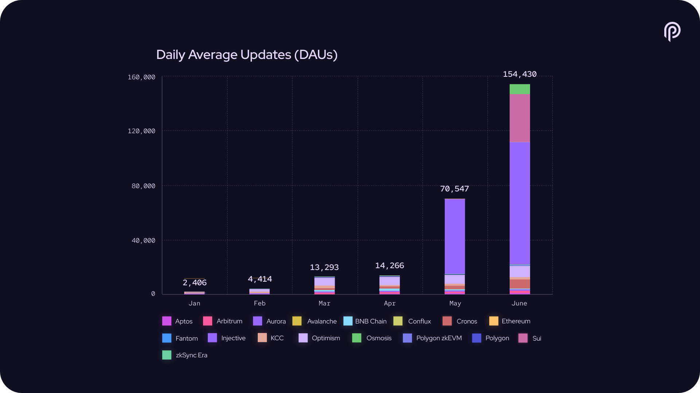
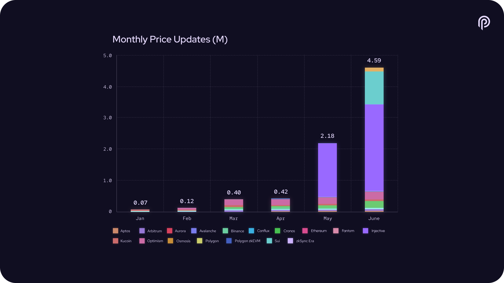
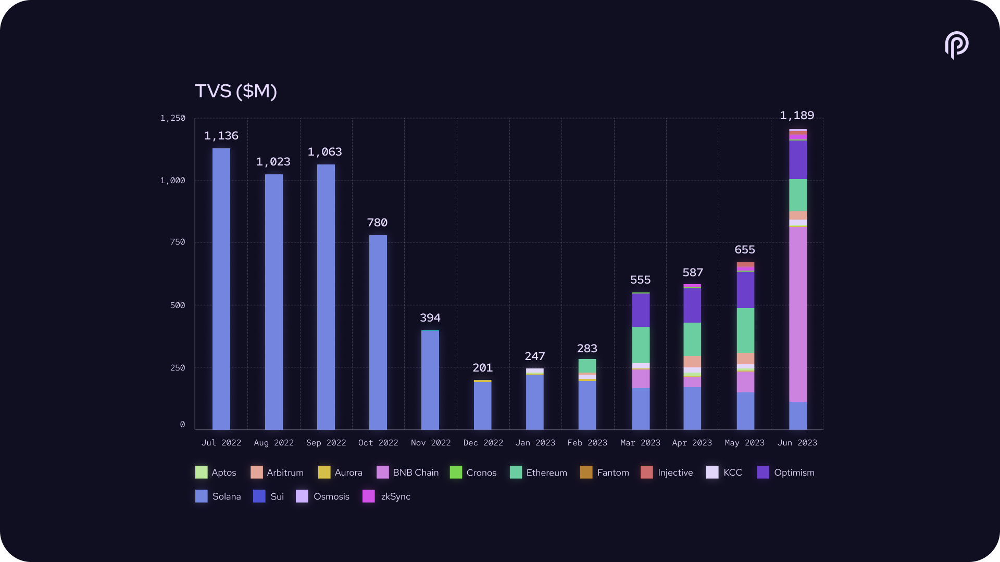
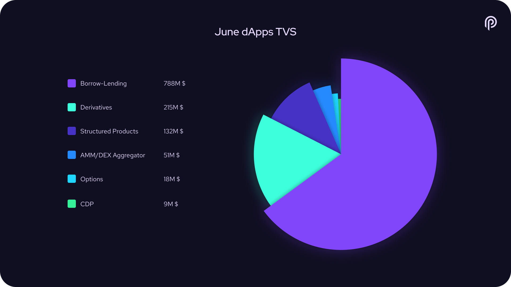
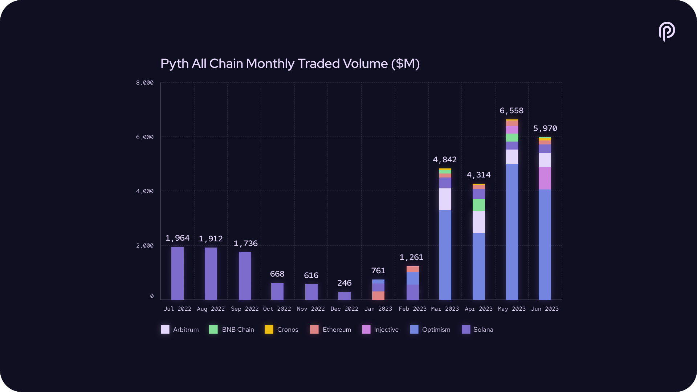
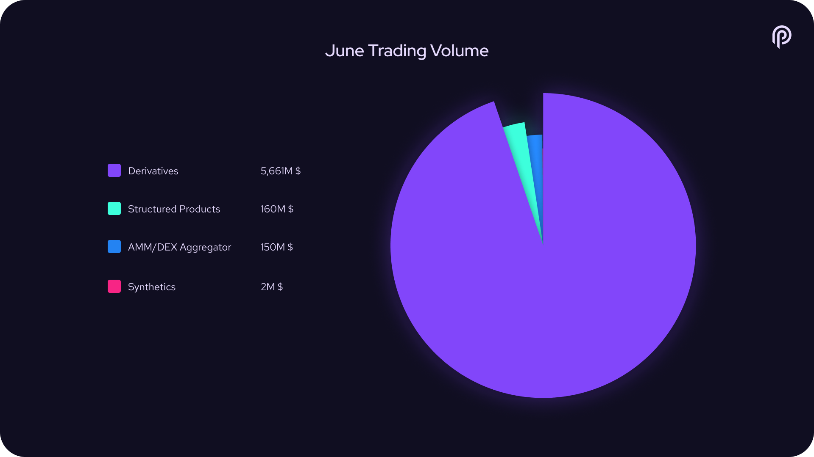
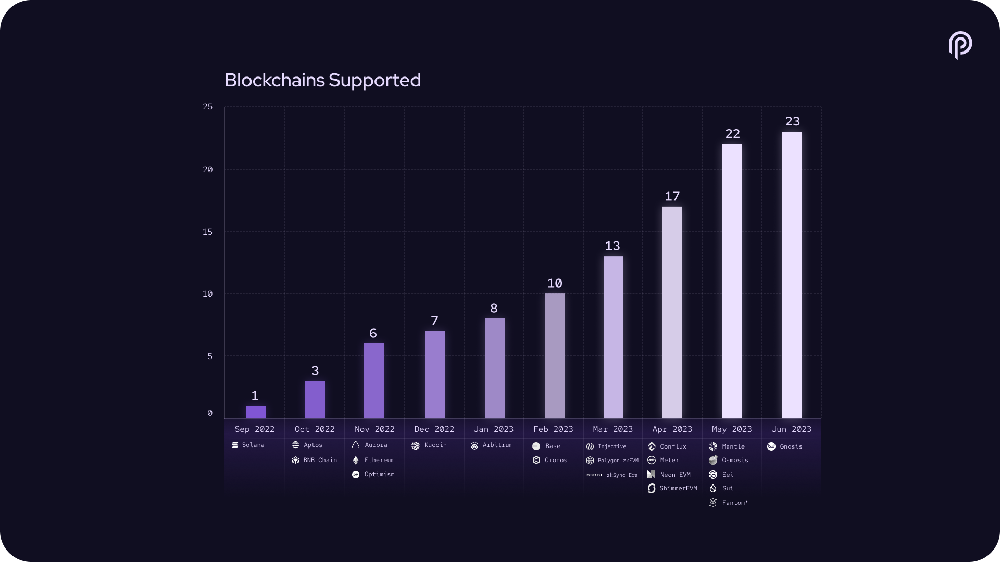

# Pyth Network KPI - July 2023

**Overall Momentum**

**Monthly Recap**

**Daily Average Updates (DAUs)**

**Cross-chain Price Updates**

**#PoweredByPyth Applications**

**Price Feeds**

**Data Providers**

**Total Value Secured**

**Total Value Secured by Segment (latest month)**

**Traded Volume**

**Trading Volume by Segment (latest month)**

**Cumulative Traded Volume**

**Connected Blockchains**

