# Pyth Network KPI - October 2023

**Overall Momentum**

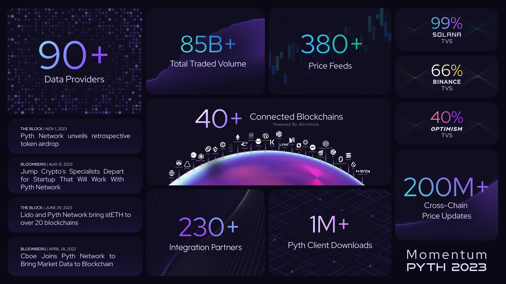

**Monthly Recap**

**Ecosystem Map**

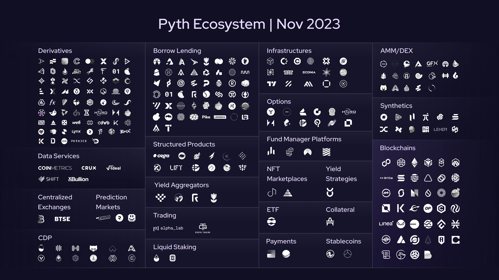

**Addressed Market by TVS**

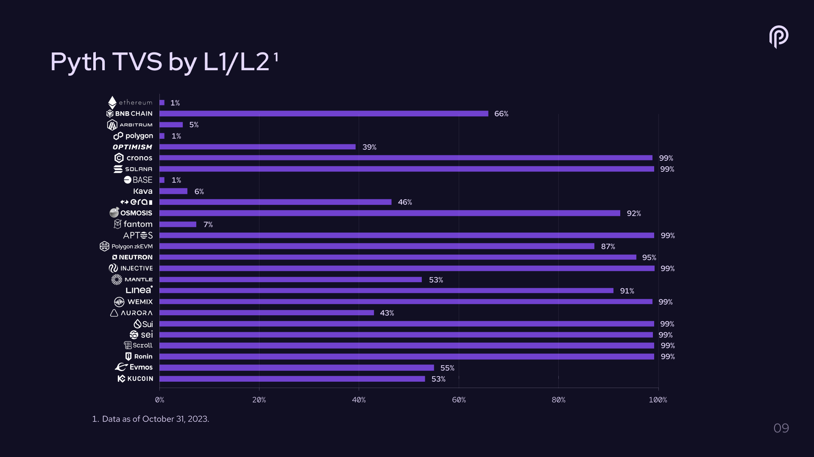

**Daily Average Updates (DAUs)**

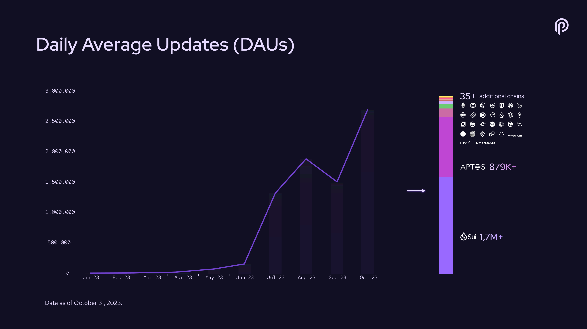

**#PoweredByPyth Applications**

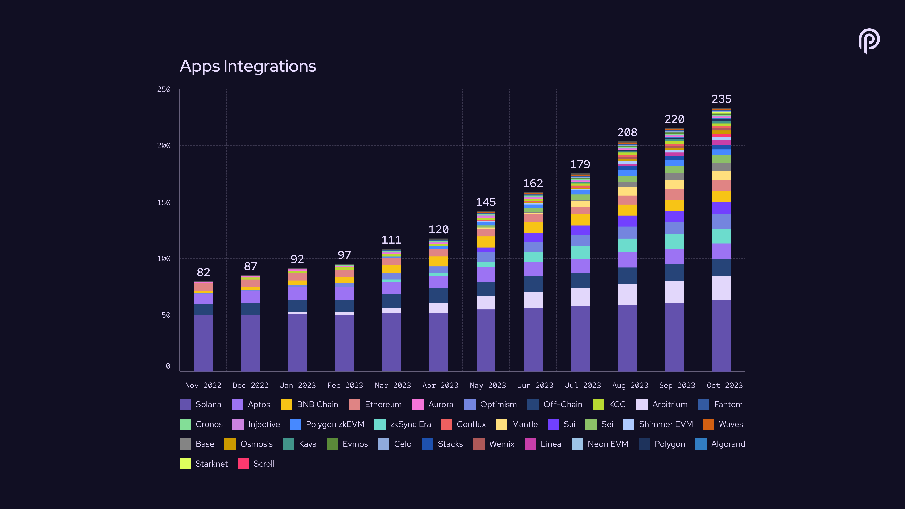

**Price Feeds**

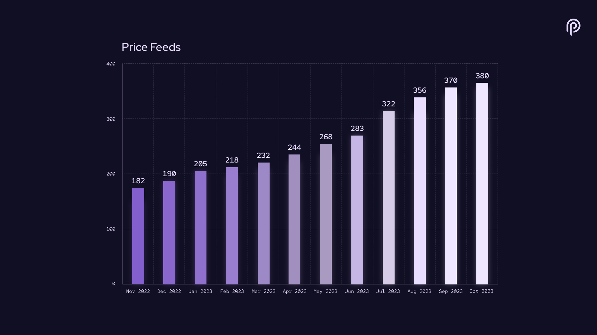

**Data Providers**

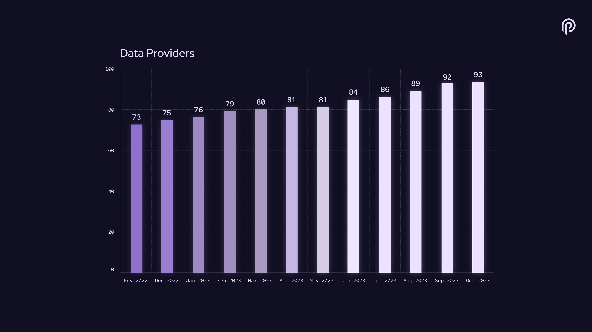

**Total Value Secured**

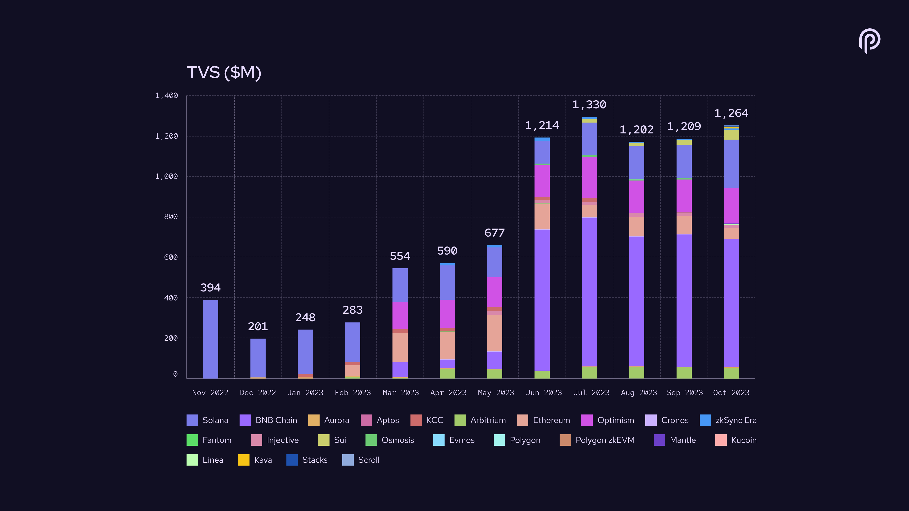

**Total Value Secured by Segment (latest month)**

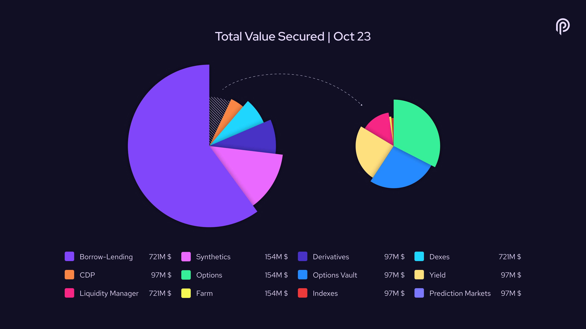

**Traded Volume**

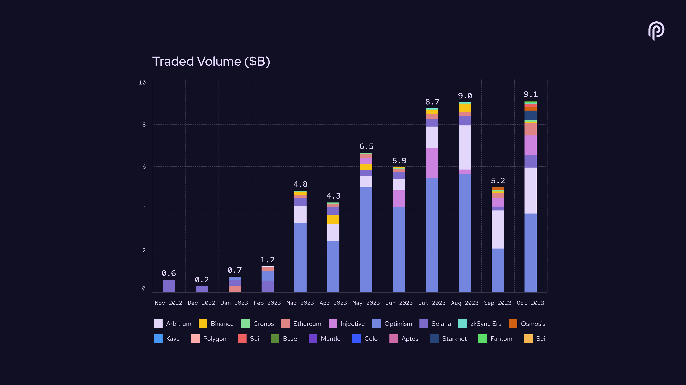

**Trading Volume by Segment (latest month)**

**Cumulative Traded Volume**

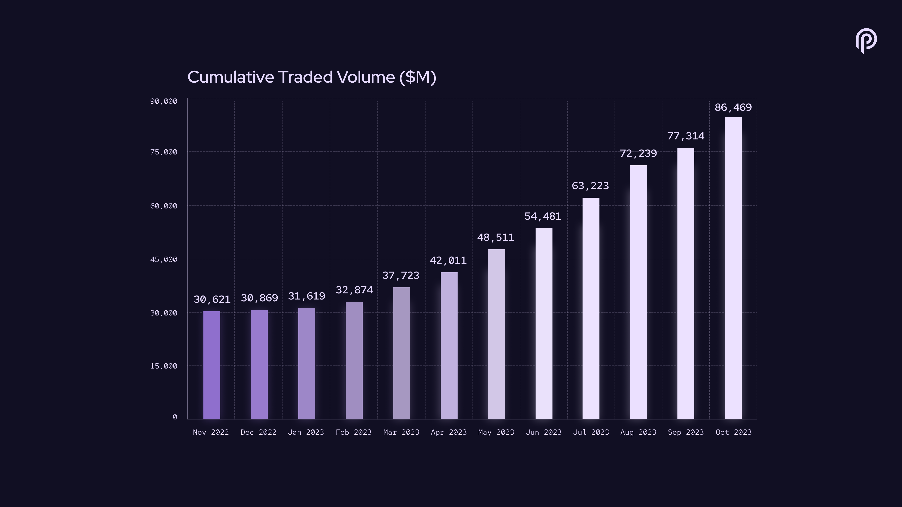

**Connected Blockchains**

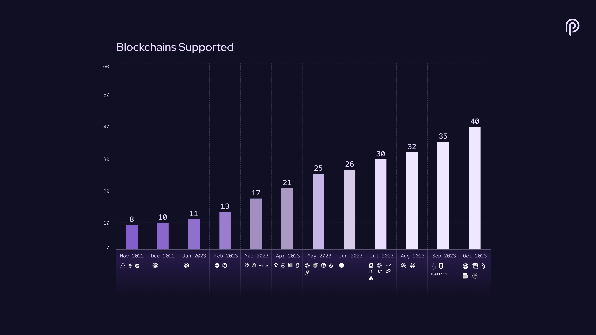
