# Pyth Network KPI - September 2023

**Overall Momentum**

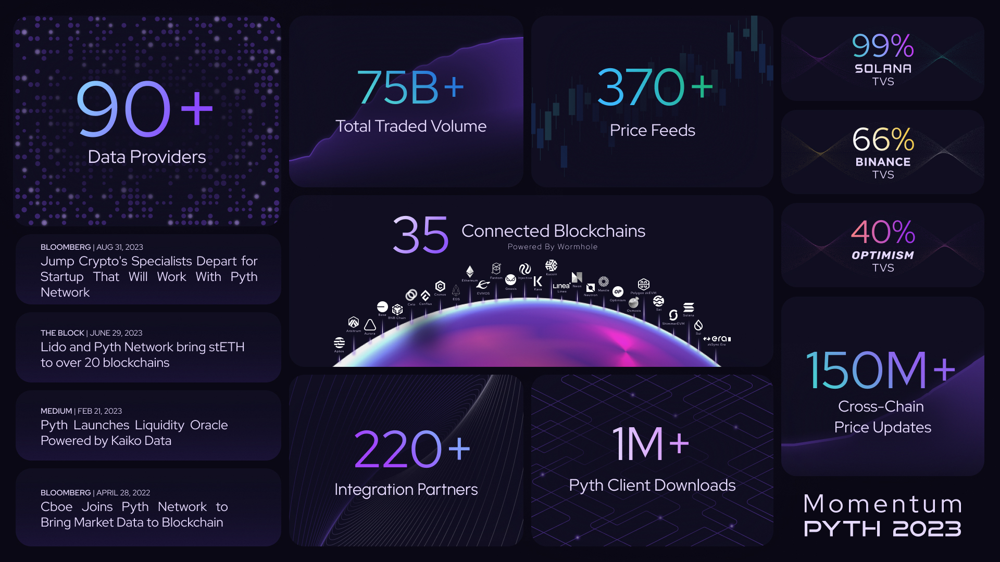

**Monthly Recap**

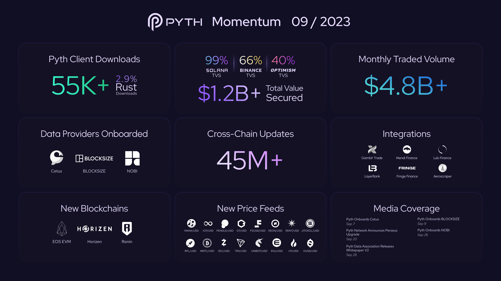

**Daily Average Updates (DAUs)**

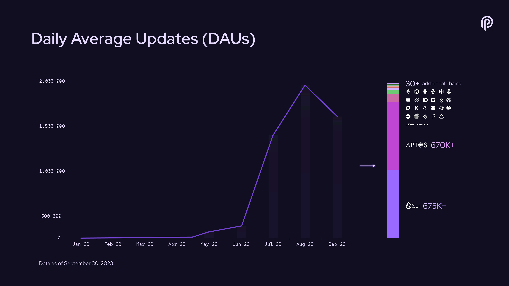

**#PoweredByPyth Applications**

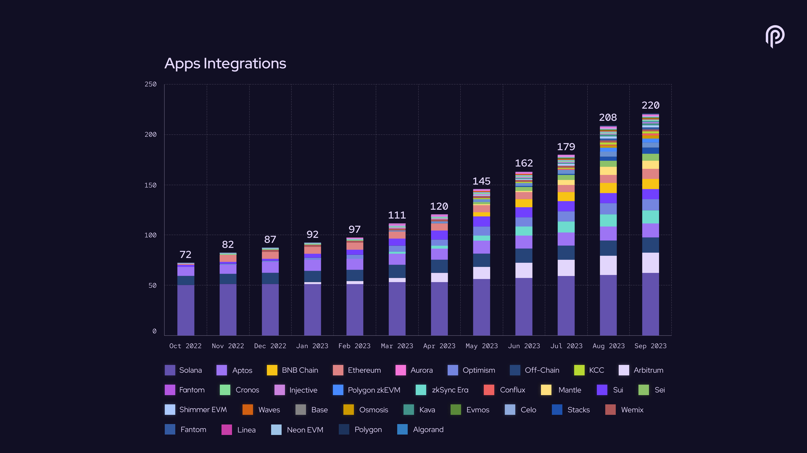

**Price Feeds**

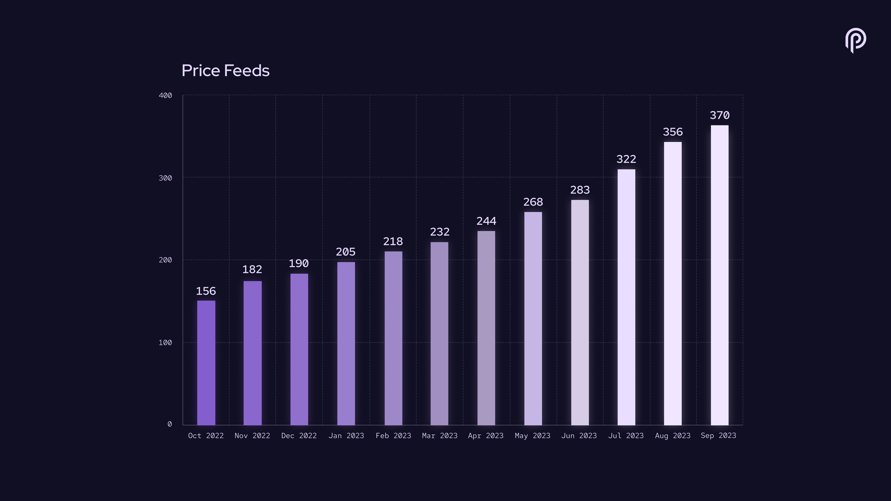

**Data Providers**

**Total Value Secured**

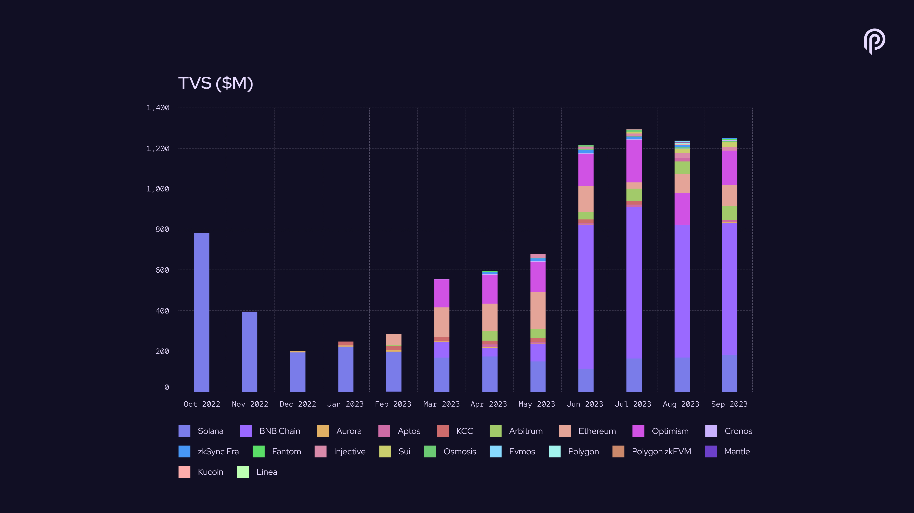

**Total Value Secured by Segment (latest month)**

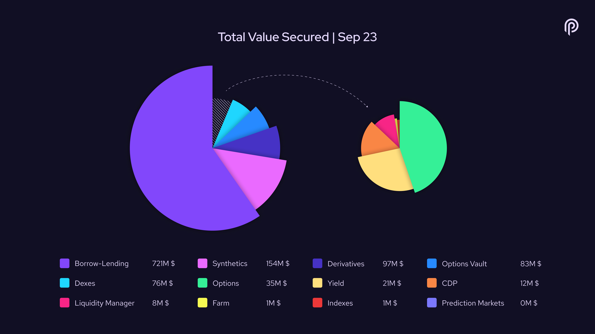

**Traded Volume**

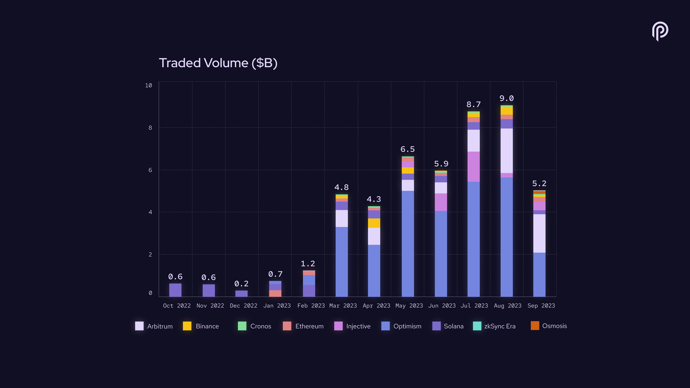

**Trading Volume by Segment (latest month)**

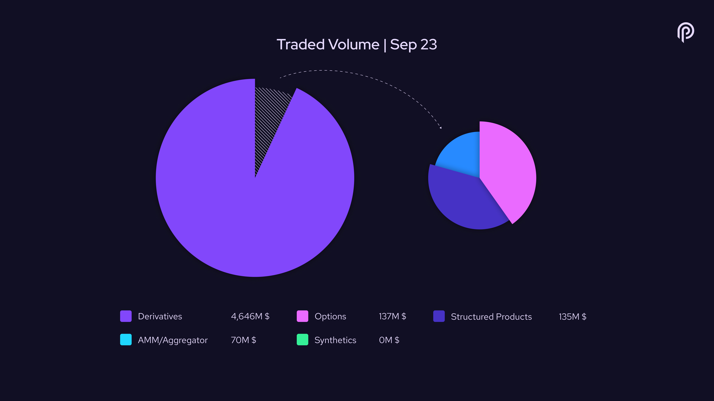

**Cumulative Traded Volume**

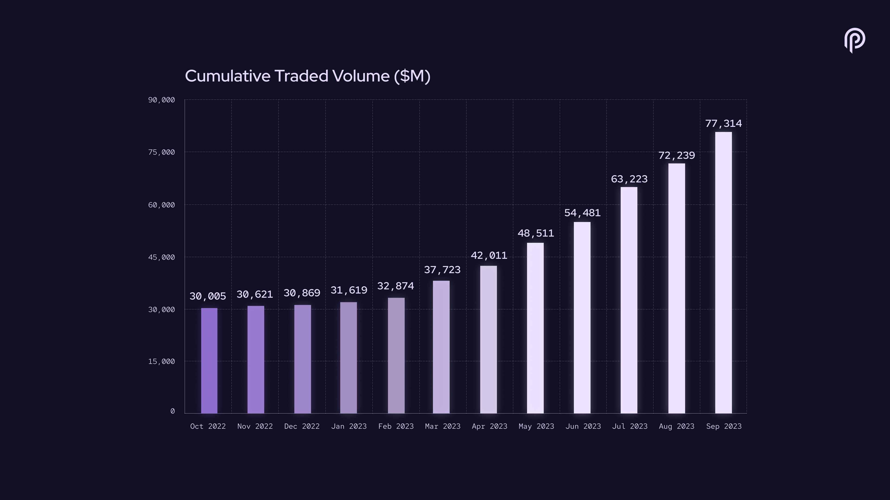

**Connected Blockchains**

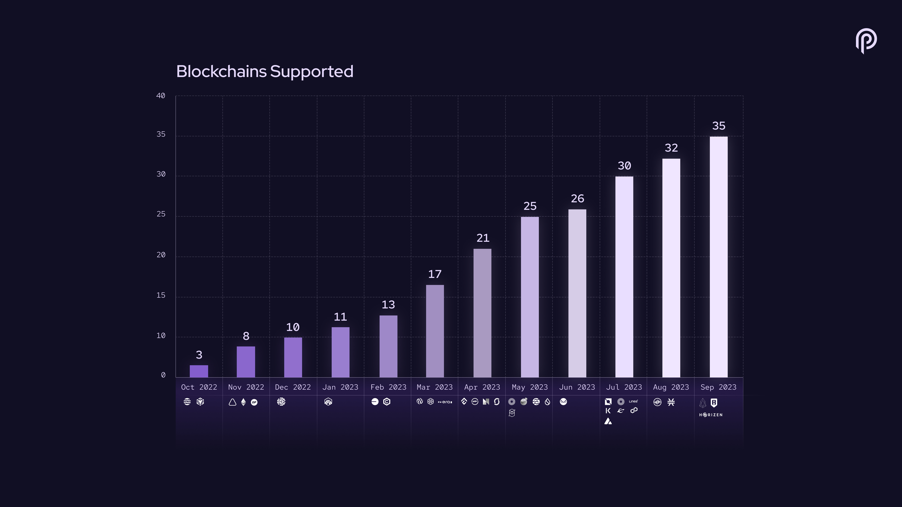
