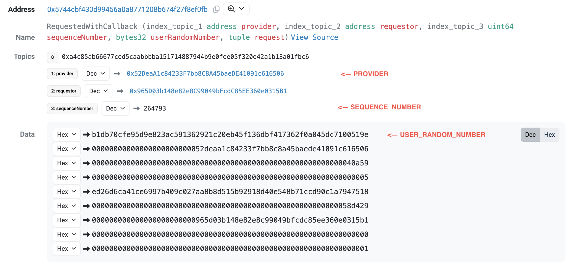

# Debug Callback Failures

import { Callout } from "nextra/components";

<Callout type="info" emoji="🔍">
  **Quick Debug Tool**: Use the [Entropy Debugger](https://entropy-debugger.pyth.network/) to quickly diagnose and resolve callback issues.
</Callout>

This guide explains how to identify and resolve issues with the Entropy callback.
The intended audience for this guide is developers who have made an Entropy random number request, but their application hasn't received a callback.

## Dependencies

This guide uses [Foundry](https://book.getfoundry.sh/getting-started/installation) to submit transactions to the blockchain.
Please install Foundry before continuing.

## Run the Callback

Developers can run the Entropy callback themselves to see the reason for the failure.
To run the callback, invoke the `revealWithCallback` function on the Entropy contract on your blockchain.
The function has the following signature:

```solidity
function revealWithCallback(address provider, uint64 sequenceNumber, bytes32 userRandomNumber, bytes32 providerRevelation)
```

This call requires the chain ID, contract address, and four arguments.
The chain ID and contract address can be retrieved from [Contract Addresses](/entropy/contract-addresses).
Export these values as environment variables for later use:

```bash copy
export CHAIN_ID=blast
export ENTROPY_ADDRESS=0x5744Cbf430D99456a0A8771208b674F27f8EF0Fb
```

Three of the arguments can be retrieved from the request transaction's event logs.
Look at the event logs of the request transaction in a block explorer.
You should see a `RequestedWithCallback` event emitted from the Entropy contract, similar to the one below:



Copy the following values from the event into environment variables:

```bash
export PROVIDER=0x52DeaA1c84233F7bb8C8A45baeDE41091c616506
export SEQUENCE_NUMBER=264793
# First row of the "Data" field with a 0x prefix
export USER_RANDOM_NUMBER=0xb1db70cfe95d9e823ac591362921c20eb45f136dbf417362f0a045dc7100519e
```

Next, collect the provider's revelation.
Every provider exposes a URL that allows users to get the provider's revelation for unfulfilled requests.
The URLs for the default providers are as follows:

| Network type | Provider URL                             |
| ------------ | ---------------------------------------- |
| testnet      | `https://fortuna-staging.dourolabs.app/` |
| mainnet      | `https://fortuna.dourolabs.app`          |

Retrieve the `/v1/chains/$CHAIN_ID/revelations/$SEQUENCE_NUMBER` endpoint from this server:

```bash copy
curl https://fortuna.dourolabs.app/v1/chains/$CHAIN_ID/revelations/$SEQUENCE_NUMBER
```

<Callout type="warning" emoji="⚠️">
  The chain ID is the string name of the chain and not the EVM chain ID. The
  chain ids are available
  [here](https://fortuna.dourolabs.app/docs/#/crate%3A%3Aapi/chain_ids).
</Callout>

This endpoint will return the provider's revelation as a hexadecimal value, such as:

```json
{
  "value": {
    "encoding": "hex",
    "data": "5d4bfa3abeaf15fe8b7771c74c0e3e210096015632831460870bc5374e05d4d8"
  }
}
```

Export this value as an environment variable (prefixed with 0x):

```bash copy
export PROVIDER_REVELATION=0x5d4bfa3abeaf15fe8b7771c74c0e3e210096015632831460870bc5374e05d4d8
```

Finally, submit the transaction to invoke `revealWithCallback`:

```bash copy
cast send $ENTROPY_ADDRESS 'revealWithCallback(address, uint64, bytes32, bytes32)' $PROVIDER_ADDRESS $SEQUENCE_NUMBER $USER_RANDOM_NUMBER $PROVIDER_REVELATION
```

You may also need to provide the `-r` with an RPC for your chain, plus an additional argument (such as `--private-key`) to specify the wallet to use to sign the transaction.

## Interpreting the Results

If the transaction succeeds, check how much gas the transaction used.
If the gas exceeds the callback gas limit for your chain as shown on [Contract Addresses](/entropy/contract-addresses), please reduce the gas usage to allow the provider to invoke the callback in the future.

If the transaction fails, it typically indicates a failure originating from the implementation of the callback function.
Check your implementation of the `entropyCallback` function to ensure that it does not throw an error when invoked.
