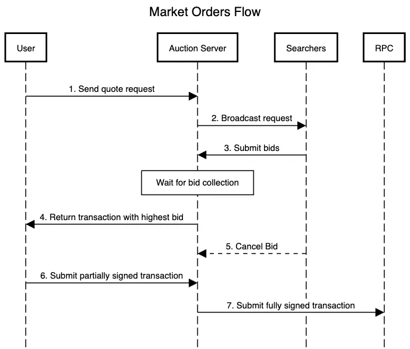

import { Callout, Tabs, Steps } from "nextra/components";

# Market Orders Integration

Unlike limit orders, market orders are created by users and need instant fulfilment within a single transaction.

### Request Flow

The following diagram illustrates the flow of a market order:


### Opportunity Structure

Quote requests are broadcasted through the same websocket channel used for receiving other opportunities. Here is a sample payload:

```jsx
{
  "opportunity_id": "44382da2-5971-453c-b647-2ba2317c7d56",
  "creation_time": 1737219684914126,
  "version": "v1",
  "program": "swap",
  "user_wallet_address": "FuBFy9TKJWxQdvramP8WTfvhVSm1h5dPiveTpyjAtwPd",
  "permission_account": "DExvQJLGprLLHuNcoRgALtn24nqSc99yuuKexza768s8",
  "router_account": "3hv8L8UeBbyM3M25dF3h2C5p8yA4FptD7FFZu4Z1jCMn",
  "referral_fee_bps": 0,
  "platform_fee_bps": 10,
  "fee_token": "searcher_token",
  "tokens": {
    "side_specified": "user",
    "searcher_token": "EPjFWdd5AufqSSqeM2qN1xzybapC8G4wEGGkZwyTDt1v",
    "user_token": "Es9vMFrzaCERmJfrF4H2FYD4KCoNkY11McCe8BenwNYB",
    "user_amount": 1000245,
    "user_amount_including_fees": 1000245,
    "token_program_searcher": "TokenkegQfeZyiNwAJbNbGKPFXCWuBvf9Ss623VQ5DA",
    "token_program_user": "TokenkegQfeZyiNwAJbNbGKPFXCWuBvf9Ss623VQ5DA"
  },
  "token_account_initialization_configs": {
    "user_ata_mint_searcher": "user_payer",
    "user_ata_mint_user": "unneeded",
    "router_fee_receiver_ta": "unneeded",
    "relayer_fee_receiver_ata": "searcher_payer",
    "express_relay_fee_receiver_ata": "searcher_payer"
  },
  "chain_id": "solana"
}
```

In this example the user with wallet address `FuBFy9TKJWxQdvramP8WTfvhVSm1h5dPiveTpyjAtwPd` wants to sell 1.000000 USDT (`Es9vMF…`) in exchange for the maximum USDC (`EPjFWdd…`) possible.

The `side_specified` field in the opportunity shows whether the user has specified a certain amount for the token they are selling(`side_specified=user`) or the token they are buying(`side_specified=searcher`). Here is a sample payload when `side_specified` is `searcher`:

```jsx
"tokens": {
    "side_specified": "searcher",
    "searcher_token": "EPjFWdd5AufqSSqeM2qN1xzybapC8G4wEGGkZwyTDt1v",
    "user_token": "Es9vMFrzaCERmJfrF4H2FYD4KCoNkY11McCe8BenwNYB",
    "searcher_amount": 1000000,
    "token_program_searcher": "TokenkegQfeZyiNwAJbNbGKPFXCWuBvf9Ss623VQ5DA",
    "token_program_user": "TokenkegQfeZyiNwAJbNbGKPFXCWuBvf9Ss623VQ5DA"
}
```

This means the user wants to the send the least amount of USDT (`Es9vMF…`) to receive exactly 1.000000 USDC (`EPjFWdd…`).

Other fields necessary for constructing the transaction include:

- `fee_token` Whether the fees will be deducted from the searcher token or the user token

  When `fee_token` is set to `user_token` the fees will be deducted from the token users provide. In this case `user_amount_including_fees > user_amount` but searchers will receive the `user_amount` in the end. You need still need to provide `user_amount_including_fees` to the contract as parameters for correct validation (SDK handles this automatically)

- `router_account` The account receiving the referral fees
- `referral_fee_bps` Amount of fees deduced from the swap in basis points
- `token_account_initialization_configs` Specifies which token accounts are required to be created in this transaction. Each of the internal fields represent one of the token accounts that potentially needs to be created.
  The value for each field can be one of the following: - `unneeded`: This token account already exists and no creation instructions are needed - `user_payer`: This token account should be created and the account storage can be paid by the user - `searcher_payer`: This token account should be created and the account storage must be paid by the searcher

The transaction containing the bid should include the following instructions:

- A `setComputeUnitPrice` instruction to adjust priority fees (similar to limit order bids)
- A set of instructions ensuring that the fee token accounts for the `user wallet` , `router`, `searcher` and the `protocol` exist. You can use the `createAssociatedTokenAccountIdempotentInstruction` instruction in the spl-token library to do this.
- A single `swap` instruction calling the Pyth Express Relay program with the necessary accounts and data. If the input amount is already specified by user, you need to set the output amount and vice versa. This would essentially represent your bid or quote for the request.

The SDKs provided will help you constructing these instructions. Please note that at the moment, these are the only instructions permitted in an swap transaction; if other types of instructions are included, the bid will not be accepted. This is for security reasons, and if you find that you need to use a different instruction not listed above please inform us. All calculations for fee distribution are done on-chain and nothing should be implemented in the SDKs or in your code.

The schema for swap bids include a partially signed transaction (with searcher as the fee payer, i.e. the first signature is the searchers) along with the `opportunity_id` received:

```jsx
{
  chain_id: 'solana',
  opportunity_id: '44382da2-5971-453c-b647-2ba2317c7d56',
  type: 'swap',
  transaction: 'Ai22...'
}
```

You must include `opportunity_id` and `type` field in bids related to market orders.

The winner bid will be communicated to the users for the final signature and on-chain submission.

### Status Updates

Bid status notifications will be sent in the same websocket channel. The bid status can have the following values:

- `lost`: Bid was not high enough and another searcher won the auction.
- `won` : Bid was submitted on-chain and is now confirmed and successful.
- `failed`: Bid was submitted on-chain and is now confirmed but the transaction failed.
- `expired`: Bid couldn’t land on-chain due to congestion.
- `awaiting_signature`: Bid won the auction and is sent to the user. Waiting for user to sign the transaction.
- `submitted`: User has signed the transaction and is now being submitted on-chain.
- `sent_to_user_for_submission`: Waiting for the user to sign the transaction and submit it directly (only or non-cancellable requests).
- `submission_failed_cancelled`: The user submitted the signature but the searcher submitted a cancellation in the meantime, so the transaction will not be submitted on-chain. This will count towards the cancellation ratio of searchers.
- `submission_failed_deadline_passed`: The user submitted the signature but it already passed the specified deadline, so it will not be submitted on-chain.

### Cancelling Bids

Searchers are able to cancel their submitted bids for cancellable quotes as long as
it’s not signed by the user (before step 6). This feature increases flexibility for more competitive pricing without additional risk of adverse selection.
This functionality is available via the `cancel_bid` api.
Here is a sample payload that can be sent via websocket:

```jsx
{
  "method": "cancel_bid",
  "params": {
    "data": {
      "bid_id": "fd586110-b22c-4e7e-a199-99c4db9c7515",
      "chain_id": "solana"
    }
  }
}
```

# Endpoints and addresses:

- Program address: [`PytERJFhAKuNNuaiXkApLfWzwNwSNDACpigT3LwQfou`](https://solscan.io/address/PytERJFhAKuNNuaiXkApLfWzwNwSNDACpigT3LwQfou)
- Auction Server Endpoint: [`https://per-mainnet.dourolabs.app/`](https://per-staging.dourolabs.app/)
- Chain id: `solana`

You can test your service using real tokens like USDC and USDT.

# Links and references:

JS SDK: https://www.npmjs.com/package/@pythnetwork/express-relay-js/

Python SDK: https://pypi.org/project/express-relay/

Rust Client SDK: https://crates.io/crates/express-relay-client

Rust API Types: https://crates.io/crates/express-relay-api-types/

Api References: https://per-mainnet.dourolabs.app/docs

Testing Ui: You can use [Kamino Swap](https://swap.kamino.finance/) or Jupiter to test
