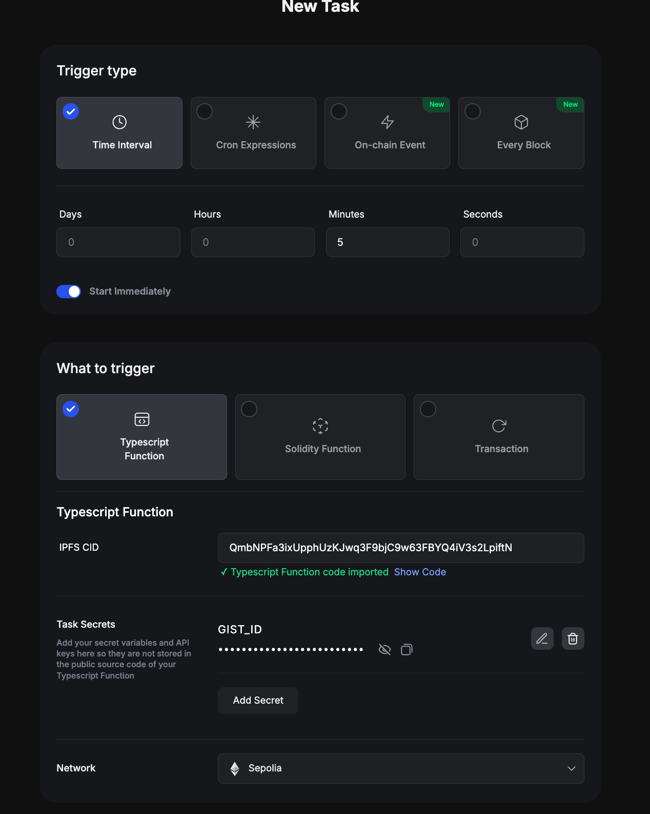
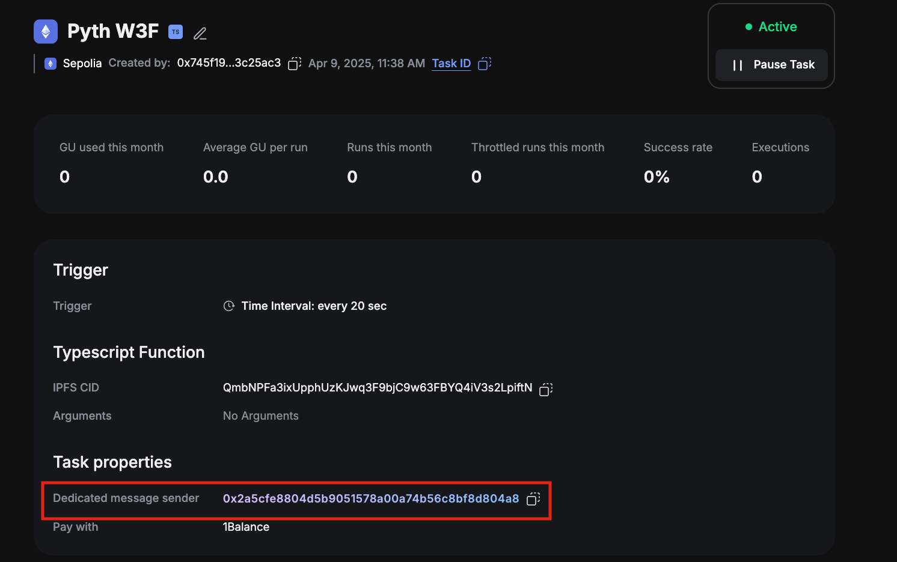
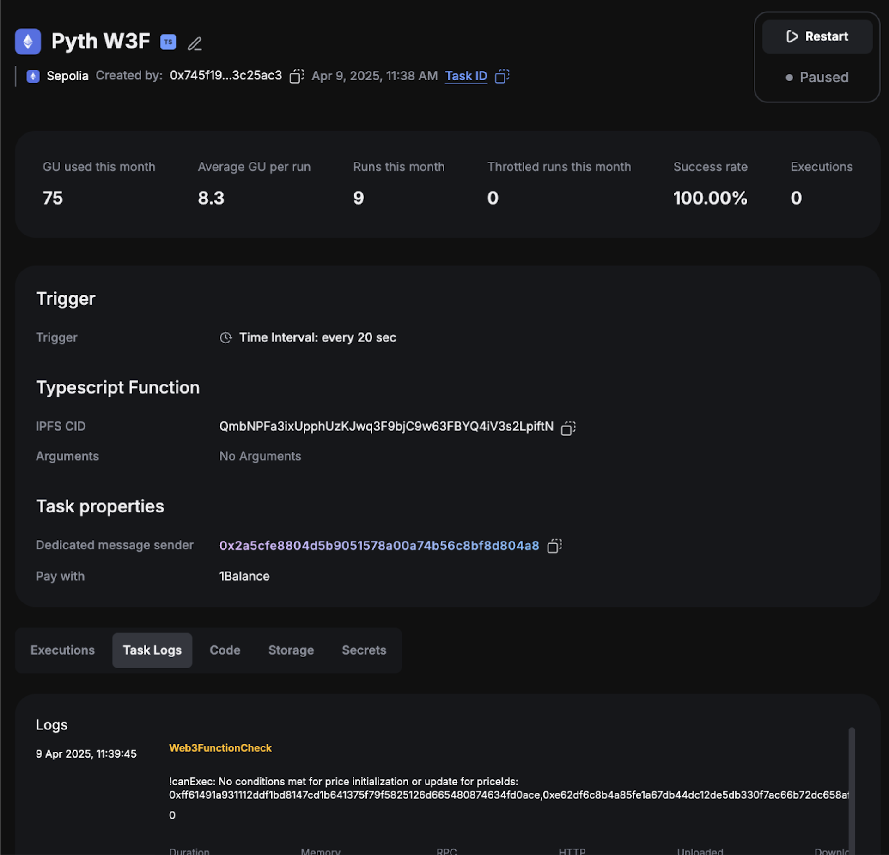

# How to Schedule Price Updates with Gelato

This guide explains how to create an automated task that updates Pyth price feeds on a schedule

### Why Gelato? Introduction to Gelato

Gelato is web3’s decentralized backend empowering builders to create augmented smart contracts that are automated,
gasless & off-chain aware on all major EVM-compatible blockchains. Gelato offers Web3 Functions (W3F) that connect your
smart contracts to off-chain data & computation by running decentralized cloud functions

### Gelato W3F Pyth Task

The Gelato W3F Pyth Task is a Gelato task that updates Pyth price feeds on a schedule.
The task is deployed to IPFS and can be used by anyone to schedule price updates for any Pyth price feed.
The task is configured via a yaml file that is hosted on GitHub gist which contains
various parameters such as the price feeds to update, the update frequency,
price deviation threshold and can be dynamically updated at any time.

## Steps

#### 1. Join Gelato Web3 Functions whitelist

Web3 Functions are currently in private beta.
Get whitelisted in the Web3 Function private Beta. If you are not, reach out to
the Gelato team [here](https://form.typeform.com/to/RrEiARiI).

#### 2. Configure your task

The Gelato task reads a yaml configuration file from a GitHub gist.
Create a GitHub gist and add a file called `config.yaml`.
The `config.yaml` file should follow the example `config.yaml` files from this

[//]: # "TODO: redirect this to pyth fork of repo)"

[directory](https://github.com/gelatodigital/w3f-pyth-poc-v2/tree/master/web3-functions/pyth-oracle-w3f-priceIds)
[example gist](https://gist.github.com/swimricky/18b2a5ad9c1a605f1cf5c19ac1d2f1d9)

Once the task is running, you can update this configuration to add more price feeds or change the update parameters.
The task will automatically pick up configuration changes.

#### 3. Create the task

Use the link below to auto-populate the task parameters with the Pyth web3 function code:

[//]: # "TODO: check/update this link"

https://beta.app.gelato.network/new-task?cid=QmTFQHpiThqkVKvuW2KU8cETNBdyXHB9uP34woL6Vc5w6g

The pyth web3 function code is deployed to IPFS, so you can use it via the cid/link above.
you can find a copy of the web3 function code [here](https://github.com/gelatodigital/w3f-pyth-poc-v2/tree/master/web3-functions/pyth-oracle-w3f-priceIds)

Choose network, and then in the "Task secrets" section, set `GIST_ID` to the gistId of the gist you created in step 2.

** Note that the beta currently only supports triggering the task every minute. Once other time intervals are available,
you will need to ensure that your current subscription plan with Gelato supports the desired number of monthly runs.
See (Subscription Plans)[https://beta.app.gelato.network/subscriptions] **.

#### 4. Fund the task

There are two sets of fees that must be paid before the task can execute successfully

**Gelato Fees**
Gelato's fees are paid through [1Balance](https://docs.gelato.network/developer-services/1balance). Once you are whitelisted, visit the [one balance app](https://beta.app.gelato.network/balance)
and deposit USDC on Polygon to top up your Gelato balance which will be used to pay the Gelato fees on all
supported chains. The Testnet executions are subsidized by Gelato and free. Make sure to create your 1Balance account
using the same wallet address that you used to create the Gelato task.

Switch network to Polygon

Deposit USDC

**Pyth Fees**
These are the fees that will be paid out to the Pyth oracle. The Pyth fees are paid in the native token of the chain
where the task is running. The method that updates the price is payable, the update transaction has to include in the
`msg.value` the corresponding fee.

The on-chain transaction executed via a web3 function gets routed through a proxy smart contract
which is solely owned by the web3 function task creator. This proxy smart contract is known as the `dedicatedMsgSender`
and will be deployed the first time a task is created for a given wallet address.

The `dedicatedMsgSender` is also responsible for paying the Pyth Fees. You will need to transfer over the native tokens
to the `dedicatedMsgSender` on every chain where you want to run the task using a standard transfer.
The `dedicatedMsgSender` address can be found in the Gelato task details under `Target smart contract` as the
`Your msg.sender` field

#### 5. Check task execution

Once your task has been successfully created, you can check the task execution details in the Gelato app.
[Example Pyth Web3 Function on Mumbai](https://beta.app.gelato.network/task/0x2c64539daaeb86addd6f556b68251a2fdf0df5c09ec07b8a30a2fbf76f4fe907?chainId=80001)

## Managing your Gelato Task

#### Monitoring

To ensure that your tasks are running as expected, you should set up monitoring. Gelato supports monitoring 1Balance and
address balances as well as execution statuses for tasks. You can set up monitoring for your Gelato balance and
the `dedicatedMsgSender` address on each chain where you are running tasks and receive notifications in either
Telegram or Discord.

See the following links for more information:
[1Balance Alerts](https://docs.gelato.network/developer-services/1balance/1balance-alerts)
[Balance Alerts](https://docs.gelato.network/developer-services/automate/execution-and-balance-alerts)

#### Updating configuration

To update the configuration of your task, such as adding/removing new priceFeeds or changing the deviation thresholds,
you can simply update the `config.yaml` file in your gist. The task will automatically pick up the changes and use them.
Note that the `config.yaml` includes a `configRefreshRateInSeconds` parameter which determines how often the task will
fetch the latest configuration from the gist vs reading a locally cached version. This is to prevent the task from being
rate-limited by GitHub.

## Notes

[//]: # "TODO: update repo & readme links to pyth fork"

If you want to customize the behavior of the web3 function beyond what is supported by updating the config.yaml, you can
clone this [repo](https://github.com/gelatodigital/w3f-pyth-poc-v2/) and deploy your own version of the web3 function.
You can then use the cid of your deployed web3 function to create a new task. See [README.md](https://github.com/gelatodigital/w3f-pyth-poc-v2/tree/master/web3-functions/pyth-oracle-w3f-priceIds/README.md) and
[Gelato Web3 Function Documentation](https://docs.gelato.network/developer-services/web3-functions) for more details.
