# Pyth Network KPI - April 2024

**Overall Momentum**

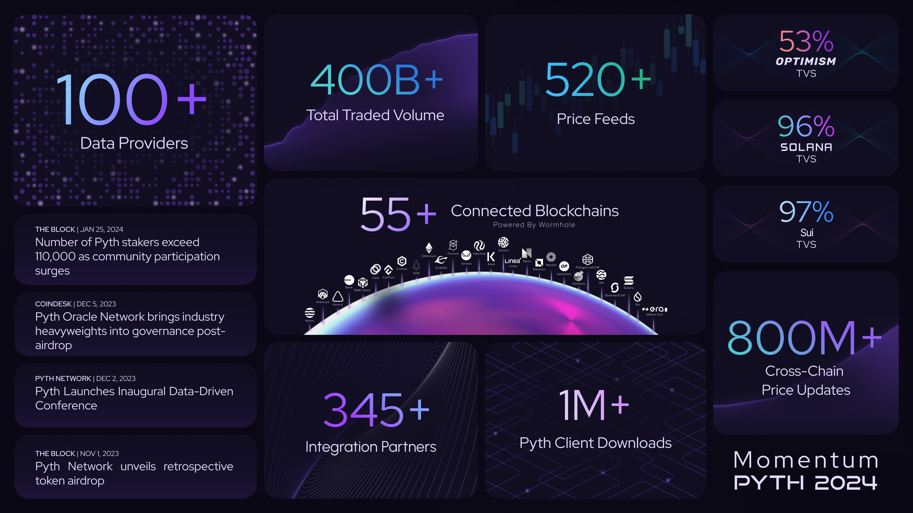

**Monthly Recap**

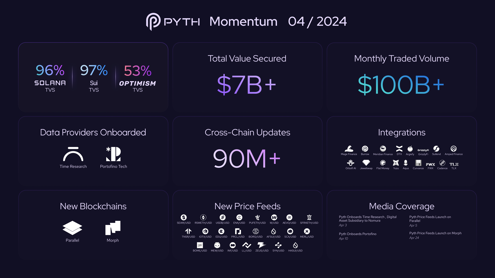

**Ecosystem Map**

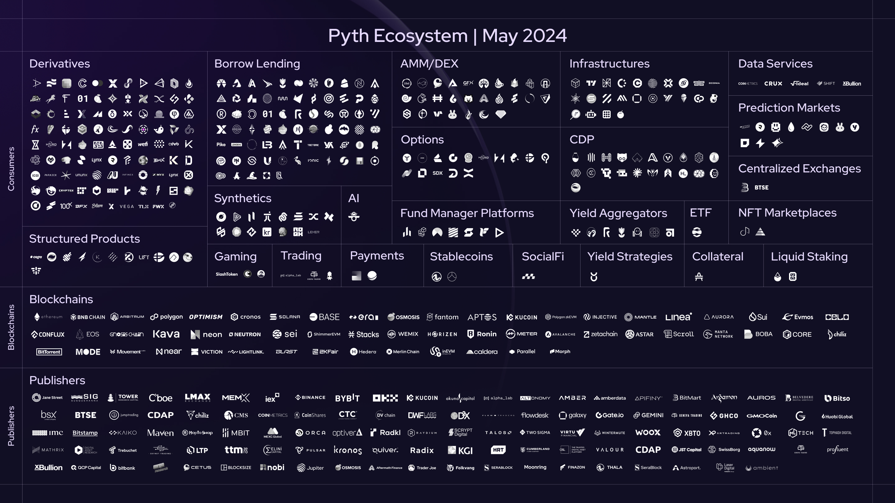

**Addressed Market by TVS**
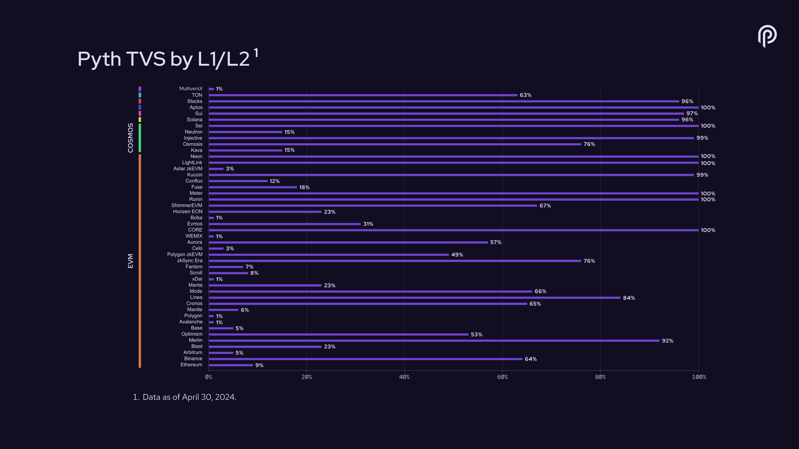

**Addressed Market by Traded Volume Secured**
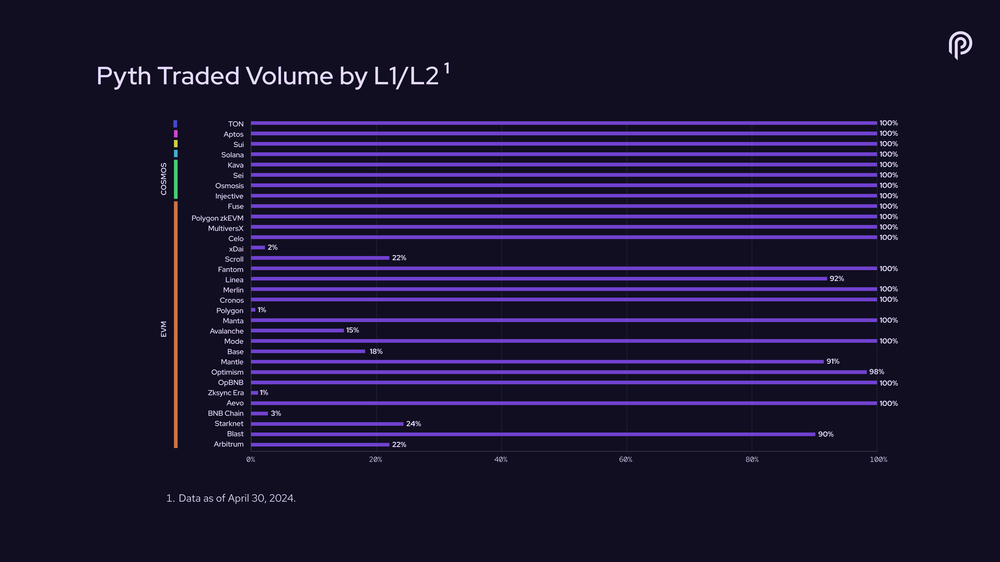

**Daily Average Updates (DAUs)**

**#PoweredByPyth Applications**

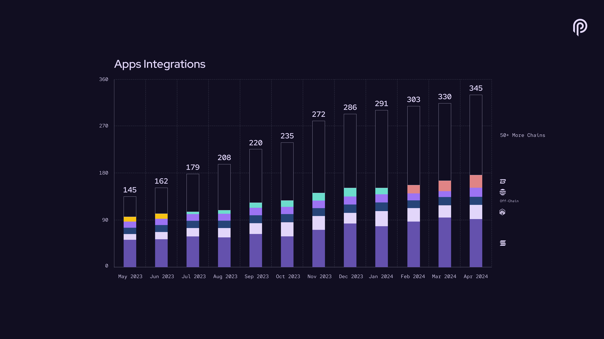

**Price Feeds**

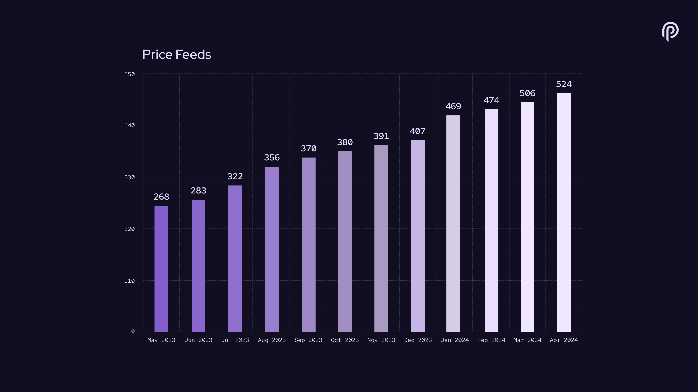

**Data Providers**

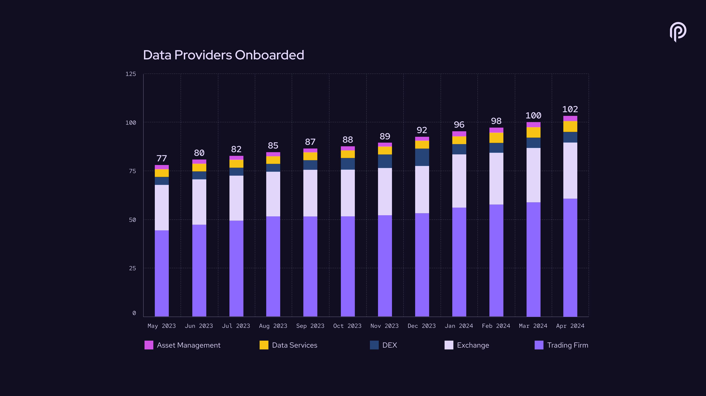

**Total Value Secured**

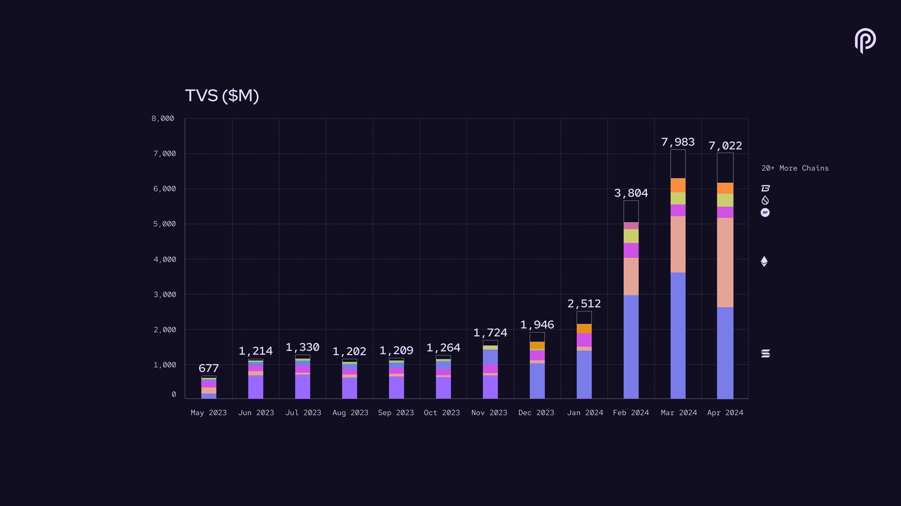

**Total Value Secured by Segment (latest month)**

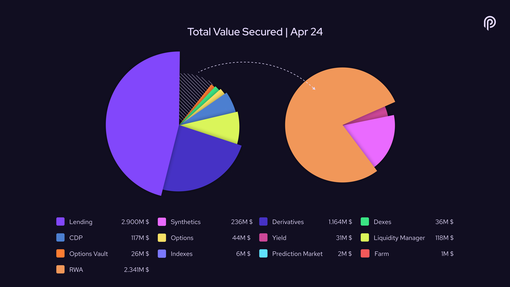

**Traded Volume**

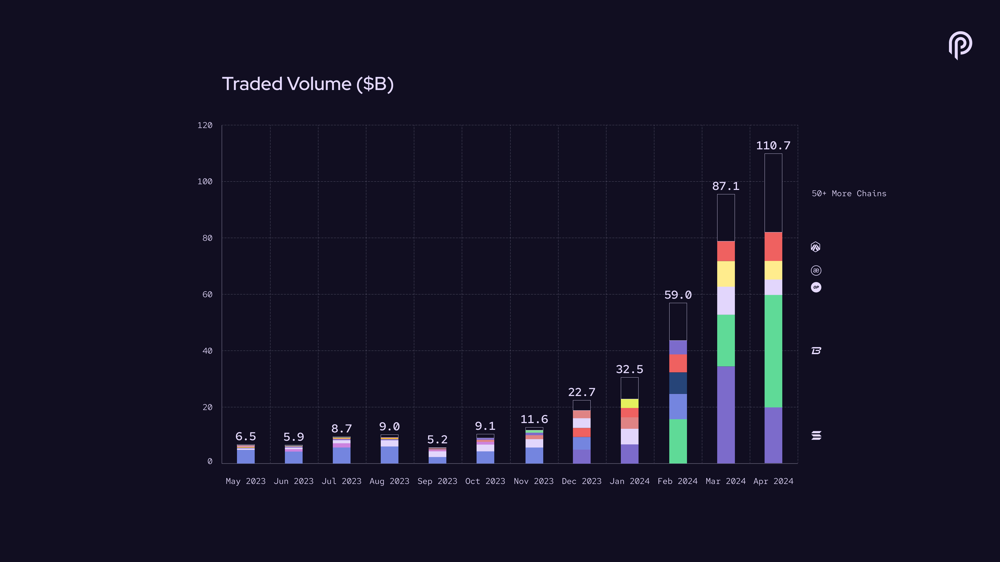

**Trading Volume by Segment (latest month)**

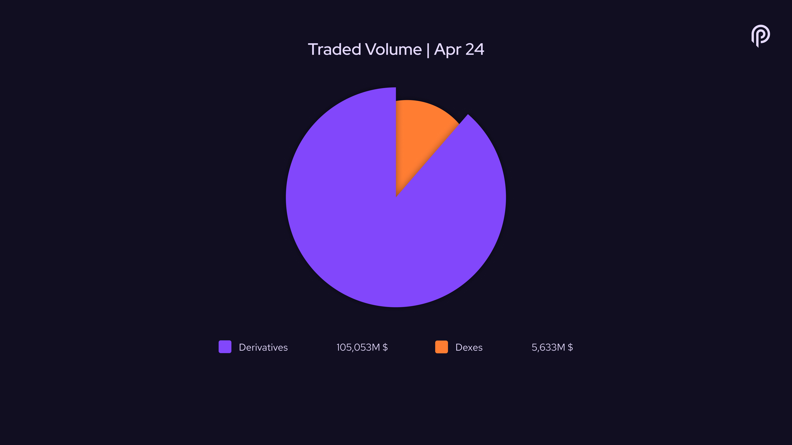

**Cumulative Traded Volume**

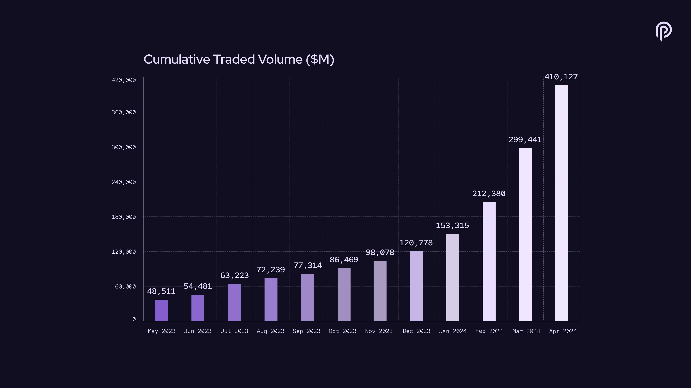

**Connected Blockchains**

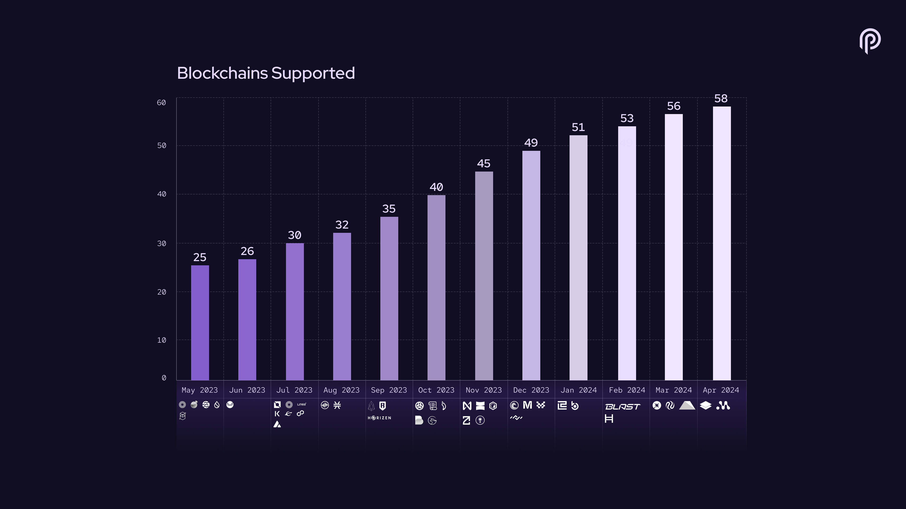
