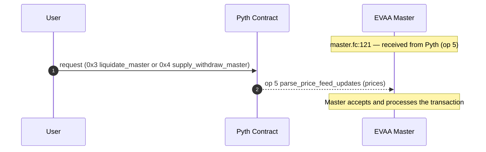
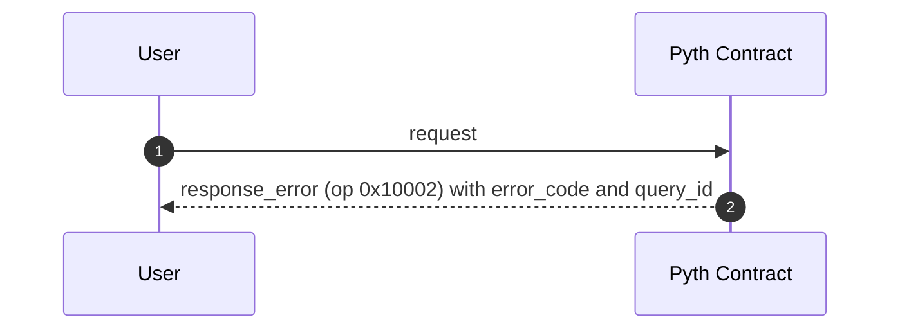
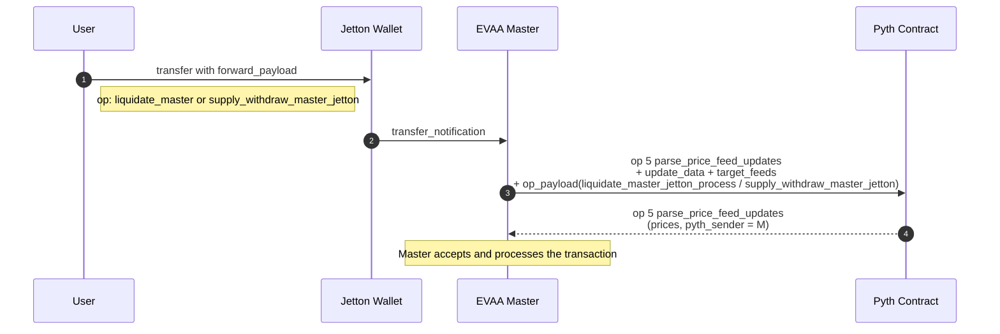
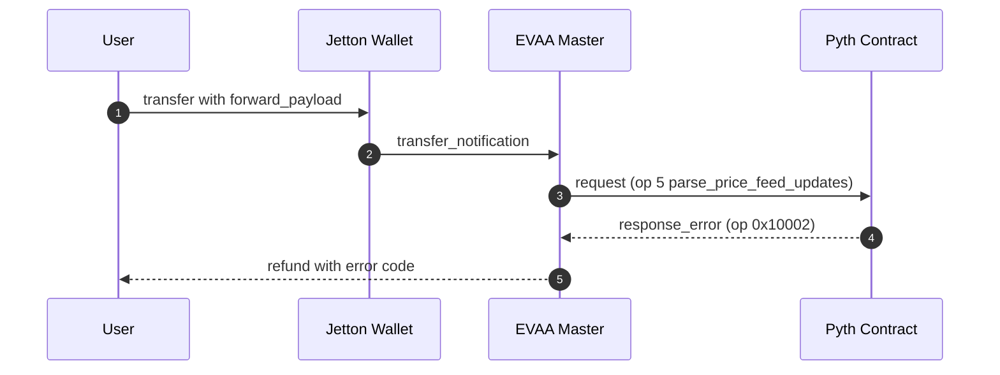

import { Tabs, Callout } from "nextra/components";

# How to Use Real-Time Data in TON Contracts

This guide explains how to use real-time Pyth data in TON applications.

## Install the Pyth SDK

Install the Pyth TON SDK and other necessary dependencies using npm:

<Tabs items={["npm", "yarn"]}>
  <Tabs.Tab>
    ```sh copy
    npm install @pythnetwork/pyth-ton-js @pythnetwork/hermes-client
    @ton/core @ton/ton @ton/crypto
    ```
  </Tabs.Tab>
  <Tabs.Tab>
    ```sh copy
    yarn add @pythnetwork/pyth-ton-js @pythnetwork/hermes-client
    @ton/core @ton/ton @ton/crypto
    ```
  </Tabs.Tab>
</Tabs>

## Write Contract Code

The code snippet below provides an example sending a message to the Pyth price feed contract and call the `parse_price_feed_updates` method:

```func copy
    ;; Create message to Pyth contract according to schema
    cell msg = begin_cell()
        .store_uint(0x18, 6)                              ;; nobounce
        .store_slice(ctx_pyth_address)                    ;; pyth contract address
        .store_coins(forward_amount)                      ;; forward amount minus fees
        .store_uint(0, 1 + 4 + 4 + 64 + 32 + 1 + 1)       ;; default message headers
        .store_uint(PYTH_OP_PARSE_PRICE_FEED_UPDATES, 32) ;; pyth opcode
        .store_ref(price_update_data)                     ;; update data
        .store_ref(price_ids)                             ;; price feed IDs
        .store_uint(now() - 100, 64)                      ;; min_publish_time
        .store_uint(now() + 100, 64)                      ;; max_publish_time
        .store_slice(my_address())                        ;; target address (this contract)
        .store_ref(custom_payload)                        ;; custom payload with recipient and amount
        .end_cell();

    send_raw_message(msg, 0);
```

## Write Client Code

The following code snippet demonstrates how to fetch price updates, interact with the Pyth contract on TON, and update price feeds:

```typescript copy
import { TonClient, Address, WalletContractV4 } from "@ton/ton";
import { toNano } from "@ton/core";
import { mnemonicToPrivateKey } from "@ton/crypto";
import { HermesClient } from "@pythnetwork/hermes-client";
import {
  PythContract,
  PYTH_CONTRACT_ADDRESS_TESTNET,
  calculateUpdatePriceFeedsFee,
} from "@pythnetwork/pyth-ton-js";
const BTC_PRICE_FEED_ID =
  "0xe62df6c8b4a85fe1a67db44dc12de5db330f7ac66b72dc658afedf0f4a415b43";
async function main() {
  // Initialize TonClient
  const client = new TonClient({
    endpoint: "https://testnet.toncenter.com/api/v2/jsonRPC",
    apiKey: "your-api-key-here", // Optional
  });
  // Create PythContract instance
  const contractAddress = Address.parse(PYTH_CONTRACT_ADDRESS_TESTNET);
  const contract = client.open(PythContract.createFromAddress(contractAddress));
  // Get current guardian set index
  const guardianSetIndex = await contract.getCurrentGuardianSetIndex();
  console.log("Guardian Set Index:", guardianSetIndex);
  // Get BTC price from TON contract
  const price = await contract.getPriceUnsafe(BTC_PRICE_FEED_ID);
  console.log("BTC Price from TON contract:", price);
  // Fetch latest price updates from Hermes
  const hermesEndpoint = "https://hermes.pyth.network";
  const hermesClient = new HermesClient(hermesEndpoint);
  const priceIds = [BTC_PRICE_FEED_ID];
  const latestPriceUpdates = await hermesClient.getLatestPriceUpdates(
    priceIds,
    { encoding: "hex" }
  );
  console.log("Hermes BTC price:", latestPriceUpdates.parsed?.[0].price);
  // Prepare update data
  const updateData = Buffer.from(latestPriceUpdates.binary.data[0], "hex");
  console.log("Update data:", updateData);
  // Get update fee
  const updateFee = await contract.getUpdateFee(updateData);
  console.log("Update fee:", updateFee);
  const totalFee =
    calculateUpdatePriceFeedsFee(BigInt(updateFee)) + BigInt(updateFee);
  // Update price feeds
  const mnemonic = "your mnemonic here";
  const key = await mnemonicToPrivateKey(mnemonic.split(" "));
  const wallet = WalletContractV4.create({
    publicKey: key.publicKey,
    workchain: 0,
  });
  const provider = client.open(wallet);
  await contract.sendUpdatePriceFeeds(
    provider.sender(key.secretKey),
    updateData,
    totalFee
  );
  console.log("Price feeds updated successfully.");
}
main().catch(console.error);
```

This code snippet does the following:

1. Initializes a `TonClient` and creates a `PythContract` instance.
2. Retrieves the current guardian set index and BTC price from the TON contract.
3. Fetches the latest price updates from Hermes.
4. Prepares the update data and calculates the update fee.
5. Updates the price feeds on the TON contract.


## Patterns for Providing Pyth Data to Your Contract

There are typically two main scenarios: either you call a method supplying TON, or you transfer jettons.

- **TON proxy**: `User → Pyth → EVAA Master → ... (further processing)`
Use this method if you only need to send TON to your contract or simply call a contract method, without involving jettons.

- **Jetton on-chain getter**: `User → Jetton Wallet → EVAA Master → Pyth → EVAA Master → ... (further processing)`
In this pattern, your contract first receives the Pyth data, then forwards it to the Pyth contract for validation, and finally gets the validated prices back.
This approach is useful when you want to transfer jettons to your contract while also providing price data.
<Callout type="info" emoji="ℹ️">
This data flow is simplified. In reality, the "Jetton Wallet" step consists of a sequence of transactions: User's jetton wallet → EVAA jetton wallet → EVAA master. These internal details are omitted here to highlight the main flow and the interaction with Pyth.
</Callout>

They both are demonstrated in the [Pyth Connector example](https://github.com/pyth-network/pyth-examples/tree/main/price_feeds/ton/pyth-connector). <br/>
These same patterns are also used in the  [EVAA Protocol code](https://github.com/evaafi/contracts/tree/v8) for implementing following operations:
- Pyth proxy pattern: liquidate TON / supply_withdraw TON.
- Onchain-getter pattern: liquidate jetton / supply_withdraw jetton.

Choose the pattern that best fits your use case and how you want to handle assets and price updates in your application.

Each operation described above can result in either a successful outcome or an error. It is important to consider and handle both scenarios for every pattern.

### Pyth proxy: Success
In the EVAA protocol, the operations that implement the Pyth proxy pattern are <b>`liquidate (TON)`</b> and <b>`supply_withdraw (TON)`</b>. In these cases, the user sends a request to the Pyth contract using the native TON asset. As a result of the operation, the user may receive either TON or JETTON tokens back, depending on the outcome of the transaction.



- Related code (GitHub):
  - [master.fc: entry for Pyth message](https://github.com/evaafi/contracts/blob/d9138cb24f03b53522774351aceb38c51a047eee/contracts/master.fc#L121)
  - [Pyth proxy: supply_withdraw (TON) in master.fc](https://github.com/evaafi/contracts/blob/d9138cb24f03b53522774351aceb38c51a047eee/contracts/master.fc#L192-L211)
  - [Pyth proxy: liquidate (TON) in master.fc](https://github.com/evaafi/contracts/blob/d9138cb24f03b53522774351aceb38c51a047eee/contracts/master.fc#L171-L190)


### Pyth proxy: Error handling
In the Pyth proxy pattern, when an error occurs (i.e., Pyth cannot process the request and sends a `response_error` with op 0x10002), the error report is sent directly back to the user who initiated the transaction, not to a contract. This is different from the on-chain getter pattern, where the error is returned to the EVAA Master contract for further handling and potential refund logic. In the proxy case, the user receives the error response from the Pyth contract, including the error code and the original query ID, allowing the user to identify and handle the failure on their side.




### Pyth onchain-getter: Success



- Related code (GitHub):
  - [Entry: master.fc (pyth_parse_price_feed_updates)](https://github.com/evaafi/contracts/blob/d9138cb24f03b53522774351aceb38c51a047eee/contracts/master.fc#L121)
  - [Onchain-getter branches: liquidate jetton and supply_withdraw jetton](https://github.com/evaafi/contracts/blob/d9138cb24f03b53522774351aceb38c51a047eee/contracts/master.fc#L131-L167)
  - [Request to Pyth (liquidate jetton)](https://github.com/evaafi/contracts/blob/d9138cb24f03b53522774351aceb38c51a047eee/contracts/core/master-liquidate.fc#L728-L742)
  - [Request to Pyth (supply_withdraw jetton)](https://github.com/evaafi/contracts/blob/d9138cb24f03b53522774351aceb38c51a047eee/contracts/core/master-supply-withdrawal.fc#L446-L461)

### Pyth onchain-getter: Pyth error
Pyth sends an error response (`response_error`, op 0x10002) when it cannot process the price feed update request. This can happen if the request is malformed, contains invalid or outdated feed data, or if the requested feeds are unavailable. In such cases, the error response includes an error code and the original operation payload, allowing the original sender (EVAA Master contract) to handle the failure and refund the user if necessary.



- Related code (GitHub):
  - [Error entry: master.fc (pyth_response_error)](https://github.com/evaafi/contracts/blob/d9138cb24f03b53522774351aceb38c51a047eee/contracts/master.fc#L92-L119)
  - [Refund (liquidate jetton)](https://github.com/evaafi/contracts/blob/d9138cb24f03b53522774351aceb38c51a047eee/contracts/core/master-liquidate.fc#L753-L786)
  - [Refund (supply_withdraw jetton)](https://github.com/evaafi/contracts/blob/d9138cb24f03b53522774351aceb38c51a047eee/contracts/core/master-supply-withdrawal.fc#L899-L935)


## Additional Resources

You may find these additional resources helpful for developing your TON application:

- [TON Documentation](https://ton.org/docs/)
- [Pyth Price Feed IDs](../price-feeds.mdx)
- [Pyth TON Contract](https://github.com/pyth-network/pyth-crosschain/tree/main/target_chains/ton/contracts)
- [Pyth TON SDK](https://github.com/pyth-network/pyth-crosschain/tree/main/target_chains/ton/sdk)
- [Pyth TON SDK Example](https://github.com/pyth-network/pyth-examples/tree/main/price_feeds/ton/sdk_js_usage)
- [Pyth TON Send USD Example](https://github.com/pyth-network/pyth-examples/tree/main/price_feeds/ton/send_usd)
- [Pyth Connector Example](https://github.com/pyth-network/pyth-examples/tree/main/price_feeds/ton/pyth-connector)
- [EVAA Protocol Code](https://github.com/evaafi/contracts/tree/v8)
